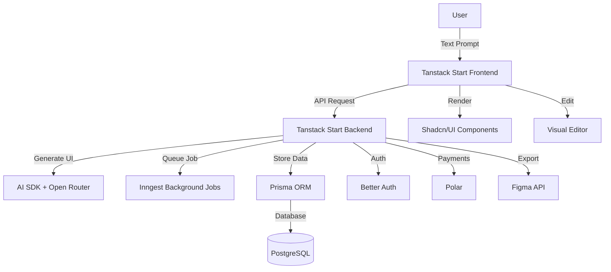

# Text-to-UI Mockup Application

## Architecture Overview

The application will be a full-stack web application with the following core components:



## Core Features

### 1. Project Structure

- **Framework**: Tanstack Start (full-stack React framework)
- **UI Components**: Shadcn/UI for the application interface
- **Database**: PostgreSQL with Prisma ORM
- **Background Jobs**: Inngest for async AI generation
- **AI**: AI SDK with Open Router for multi-model support
- **Auth**: Better Auth for authentication
- **Payments**: Polar for subscription management

### 2. Database Schema (Prisma)

**Key Models:**

- `User` - User accounts (Better Auth integration)
- `Project` - Mockup projects
- `Mockup` - Individual mockup instances
- `MockupVersion` - Version history for mockups
- `Theme` - Custom theme configurations
- `Export` - Export history (Figma, images)

### 3. AI Generation Pipeline

**Flow:**

1. User submits prompt with device selection (desktop/mobile/both)
2. Request queued via Inngest
3. AI SDK calls Open Router with structured prompt
4. AI generates React component code (TSX)
5. Component parsed and validated
6. Stored in database with metadata
7. Real-time update to frontend

**Prompt Engineering:**

- Include selected UI library constraints
- Device-specific layout instructions
- Component structure requirements
- Theme-aware generation

### 4. UI Library Integration System

**Supported Libraries:**

- Shadcn/UI (default)
- Material UI
- Ant Design
- Aceternity UI

**Implementation:**

- Dynamic component mapping system
- Library-specific component wrappers
- Runtime component loading
- Style isolation per library

### 5. Theme System

**Features:**

- Pre-built theme presets
- Custom theme builder
- CSS variables-based theming
- Real-time theme preview
- Theme persistence per project

### 6. Visual Editor

**Capabilities:**

- Drag-and-drop component editing
- Property panel for selected elements
- Layout adjustments
- Component tree navigation
- Real-time preview (desktop/mobile/both)

**Canvas Rendering Approach:**

- **Viewport/Canvas Area** - Main rendering container where mockup components are displayed
  - Centered viewport with device frame (desktop/mobile/tablet)
  - Responsive sizing with zoom controls
  - Scrollable area for larger mockups
  - Background grid/guides for alignment
- **DOM-based rendering** (not HTML5 Canvas) - Render actual React components for accurate preview
  - Components rendered in a container div (the "canvas")
  - Real React component tree with full interactivity
  - Supports all CSS styling and layouts
- **@dnd-kit/core** - Modern drag-and-drop library for component reordering and positioning
- **Overlay system** - Selection handles, resize controls, and editing indicators
  - Absolute positioned overlays on top of rendered components
  - Selection borders and resize handles
  - Hover indicators for editable elements
- **Component wrapper system** - Wrap each editable component with selection/editing capabilities
- **Why not React Flow?** - React Flow is designed for node-based diagrams/flowcharts, not UI component editing. A DOM-based approach allows:
  - Real React component rendering (accurate preview)
  - Native browser interactions (hover, click, etc.)
  - Better performance for UI mockups
  - Easier integration with existing React components
  - More accurate export to Figma/images

**Viewport Structure:**

```
┌─────────────────────────────────────┐
│  Toolbar (zoom, device selector)    │
├─────────────────────────────────────┤
│                                     │
│  ┌─────────────────────────────┐   │
│  │  Device Frame (desktop/mobile)│   │
│  │  ┌───────────────────────┐   │   │
│  │  │  Canvas Viewport      │   │   │
│  │  │  (Rendered Components)│   │   │
│  │  │  + Selection Overlays │   │   │
│  │  └───────────────────────┘   │   │
│  └─────────────────────────────┘   │
│                                     │
├─────────────────────────────────────┤
│  Property Panel | Component Tree    │
└─────────────────────────────────────┘
```

### 7. Real-time Auto-save

**Implementation:**

- Debounced auto-save on changes
- Optimistic UI updates
- Conflict resolution
- Save status indicators

### 8. Export Features

**Figma Export:**

- Convert React components to Figma nodes
- Use Figma REST API
- Create Figma file with components
- Maintain layer structure

**Image Export:**

- Server-side rendering of components
- Puppeteer/Playwright for screenshots
- Multiple format support (PNG, SVG, PDF)
- Device-specific exports

**Source Code Export:**

- Generated React component code
- Full component tree
- Dependencies list
- Copy-to-clipboard functionality

### 9. Icon System

**Features:**

- Icon library selection (Lucide, Heroicons, etc.)
- Icon picker component
- Icon replacement in components
- Icon customization (size, color)

## Implementation Plan

### Phase 1: Foundation

1. Initialize Tanstack Start project
2. Set up Prisma with PostgreSQL
3. Configure Better Auth
4. Set up Shadcn/UI
5. Create base database schema

### Phase 2: Core Generation

1. Integrate AI SDK with Open Router
2. Set up Inngest for background jobs
3. Create AI prompt templates
4. Build component parser/validator
5. Implement generation API endpoint

### Phase 3: UI Library System

1. Create library adapter system
2. Implement component wrappers for each library
3. Build dynamic import system
4. Create library selector UI

### Phase 4: Editor & Customization

1. Install and configure @dnd-kit for drag-and-drop
2. Build viewport component (device frame + rendering area)
3. Create mockup renderer component (renders React components in viewport)
4. Build DOM-based canvas/editor view (main container)
5. Create selection overlay system with handles
6. Implement component wrapper for editing capabilities
7. Build drag-and-drop functionality
8. Add zoom controls and device frame switching
9. Create property panel
10. Build theme system
11. Add icon picker

### Phase 5: Export & Viewing

1. Implement Figma API integration
2. Build image export service
3. Create source code viewer
4. Add export history

### Phase 6: Polish & Integration

1. Integrate Polar for payments
2. Add real-time auto-save
3. Implement version history
4. Add user dashboard
5. Performance optimization

## Key Files Structure

```javascript
app/
  routes/
    _index.tsx              # Landing page
    projects/
      $id.tsx               # Project editor
      $id.source.tsx        # Source code view
    api/
      generate/             # AI generation endpoint
      export/
        figma.ts            # Figma export
        image.ts            # Image export
      save/                 # Auto-save endpoint
  components/
    editor/                 # Visual editor components
      canvas.tsx            # Main canvas/editor view (viewport container)
      viewport.tsx          # Viewport component (device frame + rendering area)
      mockup-renderer.tsx   # Component that renders the mockup React components
      selection-overlay.tsx # Selection handles and controls
      component-wrapper.tsx # Wrapper for editable components
      property-panel.tsx    # Property editing panel
      component-tree.tsx    # Component tree navigation
      device-frame.tsx      # Device frame (desktop/mobile/tablet)
      toolbar.tsx           # Editor toolbar (zoom, device selector, etc.)
    theme/                  # Theme system
    icon-picker/            # Icon selection
    library-selector/       # UI library selector
  lib/
    ai/                     # AI SDK integration
    libraries/              # UI library adapters
    figma/                  # Figma API client
    export/                 # Export utilities
prisma/
  schema.prisma             # Database schema
inngest/
  functions/
    generate-mockup.ts      # Background generation job
```

## Technical Considerations

1. **Component Validation**: Parse and validate generated React code before rendering
2. **Security**: Sanitize AI-generated code, prevent XSS
3. **Performance**: Lazy load UI libraries, optimize rendering
4. **Error Handling**: Graceful fallbacks for AI generation failures
5. **Rate Limiting**: Implement rate limits for AI generation
6. **Caching**: Cache generated components to reduce API calls
7. **Scalability**: Queue system for high-load scenarios

## Technical Decisions

### Canvas Rendering for Visual Editor

**Decision: DOM-based rendering with @dnd-kit (not React Flow or Canvas)**

**Rationale:**

- React Flow is designed for node-based diagrams/flowcharts, not UI component editing
- DOM-based approach allows real React component rendering for accurate preview
- Better performance and easier integration with existing React components
- More accurate export to Figma/images since we're working with actual DOM elements
- Native browser interactions (hover, click, etc.) work naturally

**Implementation:**

- **Viewport Component**: Container with device frame (desktop/mobile/tablet) and centered rendering area
- **Mockup Renderer**: Dynamically renders the generated React components using React's rendering system
- Use `@dnd-kit/core` and `@dnd-kit/sortable` for drag-and-drop
- Create overlay system with selection handles and resize controls (absolute positioned divs)
- Wrap editable components with selection/editing capabilities
- Use CSS positioning for layout adjustments
- Implement component tree navigation with React state
- Add zoom controls (fit to screen, 50%, 100%, 200%, etc.)
- Device frame switching (desktop/mobile/tablet preview modes)

## Open Questions to Resolve

1. **Component Storage**: Store as code strings or parsed AST?
2. **Version Control**: Full version history or incremental diffs?
3. **Collaboration**: Future multi-user support considerations?
4. **AI Model Selection**: Allow users to choose AI model or auto-select?